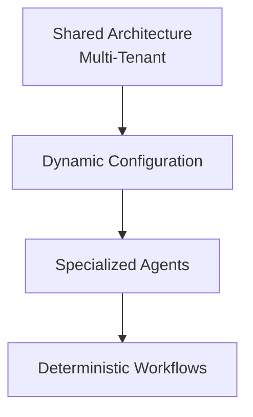

# Arquitetura Multi-Tenant de Atendimento com IA para Clínicas

> Arquitetura de automação com IA para atendimento via WhatsApp, projetada para atender múltiplas clínicas com uma única estrutura de processamento, configurada dinamicamente por tenant.

Este repositório documenta a **arquitetura conceitual** de um sistema de atendimento automatizado desenvolvido para clínicas, com foco em multi-tenancy, orquestração de agentes de IA e execução determinística de operações críticas.

> ⚠️ Este é um repositório de **documentação técnica de portfólio**. Ele descreve decisões de arquitetura e fluxos conceituais. Não contém workflows reais do n8n, prompts proprietários, credenciais, dados de clínicas/pacientes ou qualquer informação capaz de reconstruir o produto.

## Índice da documentação

| Documento | Conteúdo |
|---|---|
| [`docs/01-visao-geral.md`](docs/01-visao-geral.md) | Visão geral do sistema e o problema que ele resolve |
| [`docs/02-multi-tenancy.md`](docs/02-multi-tenancy.md) | Conceito multi-tenant e configuração dinâmica da IA |
| [`docs/03-fluxo-de-mensagens.md`](docs/03-fluxo-de-mensagens.md) | Fluxo de mensagens, normalização, buffer (Redis) e memória conversacional |
| [`docs/04-guardrails-e-agentes.md`](docs/04-guardrails-e-agentes.md) | Camada de guardrails e orquestração de agentes (Router, Service, Scheduling) |
| [`docs/05-execucao-deterministica.md`](docs/05-execucao-deterministica.md) | Separação entre interpretação (LLM) e execução (código) + arquitetura de responsabilidades |
| [`docs/06-stack-tecnica.md`](docs/06-stack-tecnica.md) | Tecnologias usadas e o que foi desenvolvido vs. componentes de terceiros |
| [`docs/07-limitacoes-e-roadmap.md`](docs/07-limitacoes-e-roadmap.md) | Limitações conhecidas, roadmap e princípio de design |

## Resumo

O sistema funciona como uma secretária virtual: interpreta mensagens de WhatsApp (texto, áudio, imagem, vídeo, documento), mantém contexto de conversa, responde dúvidas institucionais e executa operações de agenda (criar, consultar, cancelar, reagendar).

O diferencial não é "uma IA para clínicas", mas sim:

> Uma estrutura compartilhada de processamento, configurada dinamicamente por tenant, na qual mensagens são normalizadas e agregadas antes do processamento, agentes especializados cuidam de responsabilidades distintas, e operações críticas são delegadas a workflows determinísticos em vez de raciocínio livre da LLM.

## Stack

n8n · Evolution API · Gemini API · OpenAI API· Redis · PostgreSQL · Supabase · Docker Swarm
