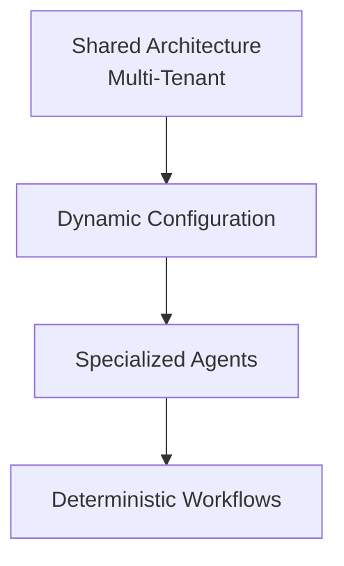

# Multi-Tenant AI-Powered Patient Support Architecture for Clinics

> An AI automation architecture for patient support via WhatsApp, designed to serve multiple clinics through a single processing infrastructure, dynamically configured per tenant.

This repository documents the **conceptual architecture** of an automated patient support system developed for clinics, focusing on multi-tenancy, AI agent orchestration, and deterministic execution of critical operations.

> ⚠️ This is a **technical portfolio documentation repository**. It describes architectural decisions and conceptual flows. It does not contain actual n8n workflows, proprietary prompts, credentials, clinic/patient data, or any information that could be used to reconstruct the product.

## Documentation Index

| Document                                                                   | Content                                                                                    |
| -------------------------------------------------------------------------- | ------------------------------------------------------------------------------------------ |
| [`docs/01-overview.md`](docs/01-overview.md)                               | System overview and the problem it solves                                                  |
| [`docs/02-multi-tenancy.md`](docs/02-multi-tenancy.md)                     | Multi-tenant architecture and dynamic AI configuration                                     |
| [`docs/03-message-flow.md`](docs/03-message-flow.md)                       | Message flow, normalization, buffering (Redis), and conversational memory                  |
| [`docs/04-guardrails-and-agents.md`](docs/04-guardrails-and-agents.md)     | Guardrail layer and agent orchestration (Router, Service, Scheduling)                      |
| [`docs/05-deterministic-execution.md`](docs/05-deterministic-execution.md) | Separation between interpretation (LLM) and execution (code) + responsibility architecture |
| [`docs/06-technical-stack.md`](docs/06-technical-stack.md)                 | Technologies used and what was developed vs. third-party components                        |

## Summary

The system operates as a virtual receptionist: it interprets WhatsApp messages (text, audio, images, videos, and documents), maintains conversational context, answers institutional questions, and performs scheduling operations (create, retrieve, cancel, and reschedule appointments).

The key differentiator is not simply **"AI for clinics"**, but rather:

> A shared processing infrastructure dynamically configured per tenant, where messages are normalized and aggregated before processing, specialized agents handle distinct responsibilities, and critical operations are delegated to deterministic workflows instead of relying on unrestricted LLM reasoning.

## Stack

n8n · Evolution API · Gemini API · OpenAI API · Redis · PostgreSQL · Supabase · Docker Swarm
