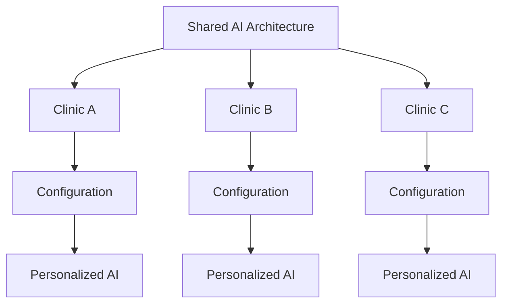

# 2. Multi-Tenant Concept

Instead of creating an independent AI or workflow for each clinic, the system uses a shared architecture that receives tenant-specific configurations at runtime.



Tenant differentiation is handled through a unique identifier (**clinicKey**), received in the initial payload — enriched by an intermediate application layer — and propagated throughout the flow for operations that need to query the external system.

## Dynamic AI Configuration

Three context blocks are dynamically assembled before any agent is executed:

| Block                       | Content                                                                                   |
| --------------------------- | ----------------------------------------------------------------------------------------- |
| **Assistant Configuration** | Rules and behavior configured by the platform user                                        |
| **Clinic Configuration**    | Name, institutional information, business hours, services, and other clinic-specific data |
| **Patient Context**         | Available patient information, when applicable                                            |

```text
Same AI Structure + Dynamic Context = Tenant-specific Behavior
```

This shared structure makes it possible to reuse the same agent architecture across different clinics while maintaining tenant-specific behavior.

---

⬅ [Overview](./01-overview.md) · [Index](../README.md) · Next → [Message Flow](./03-message-flow.md)
