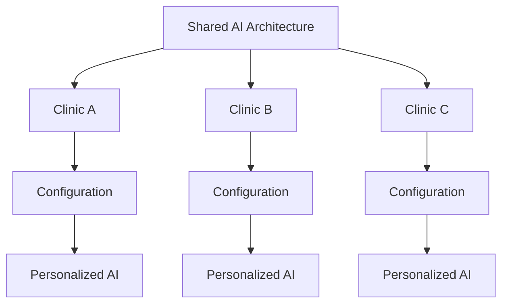

# 2. Conceito Multi-Tenant

Em vez de criar uma IA ou workflow independente por clínica, existe uma estrutura única que recebe configurações específicas de cada tenant em tempo de execução.



A diferenciação entre tenants é feita por um identificador único (**clinicKey**), recebido já no payload inicial — enriquecido por uma camada intermediária da aplicação — e propagado ao longo do fluxo para as operações que precisam consultar o sistema externo.

## Configuração dinâmica da IA

Três blocos de contexto são montados dinamicamente antes de qualquer agente ser executado:

| Bloco | Conteúdo |
|---|---|
| **Assistant Configuration** | Regras e comportamento configurados pelo usuário da plataforma |
| **Clinic Configuration** | Nome, dados institucionais, horários, serviços e demais informações da clínica |
| **Patient Context** | Informações disponíveis sobre o paciente, quando existentes |

```
Same AI Structure + Dynamic Context = Tenant-specific Behavior
```

Essa estrutura comum é o que permite reutilizar a mesma arquitetura de agentes entre clínicas diferentes.

---

⬅ [Visão geral](./01-visao-geral.md) · [Índice](../README.md) · Próximo → [Fluxo de mensagens](./03-fluxo-de-mensagens.md)
