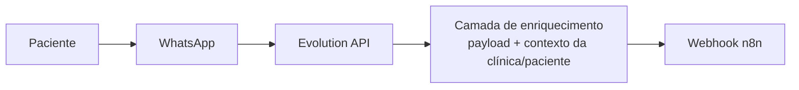
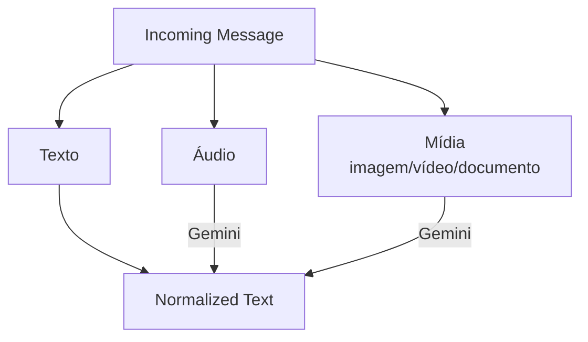
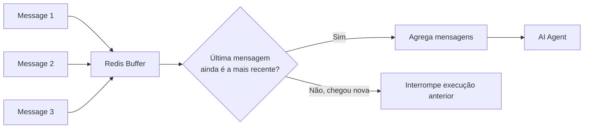

# 3. Fluxo de Mensagens



A camada de enriquecimento pertence à infraestrutura da aplicação (fora do workflow principal) e adiciona ao payload os dados de contexto necessários — clínica, assistente e paciente.

Ao entrar no n8n, os dados são reorganizados em blocos conceituais de contexto:

```
Assistant Configuration
        +
Clinic Configuration
        +
Patient Context
        +
Current Message
```

## Normalização de mensagens

O sistema aceita múltiplos formatos de entrada e converte tudo para uma representação textual comum antes de qualquer processamento pelos agentes.



Isso evita que cada agente precise lidar individualmente com múltiplos formatos de entrada.

## Buffer de mensagens (Redis)

Usuários de WhatsApp costumam enviar várias mensagens curtas em sequência ("Oi", "queria saber", "se vocês atendem Unimed"). Processar cada uma isoladamente geraria execuções redundantes da IA e pouco contexto por execução.

Solução: as mensagens são acumuladas no **Redis** dentro de uma janela de ~30 segundos.



Se uma mensagem mais nova chega antes da janela expirar, o processamento anterior é interrompido — evitando respostas duplicadas ou fora de ordem.

O Redis aqui tem responsabilidade diferente da memória conversacional: é **estado temporário**, não histórico.

## Memória conversacional

Implementada com o mecanismo de Chat Memory do n8n, persistido em **PostgreSQL**. Mantém uma janela de histórico recente para dar contexto aos agentes durante o atendimento.

| Componente | Responsabilidade |
|---|---|
| Redis | Buffer temporário de mensagens |
| PostgreSQL / Chat Memory | Histórico conversacional |
| Sistema externo | Dados persistentes de domínio (clínicas, pacientes, agenda) |

---

⬅ [Multi-tenancy](./02-multi-tenancy.md) · [Índice](../README.md) · Próximo → [Guardrails e agentes](./04-guardrails-e-agentes.md)
