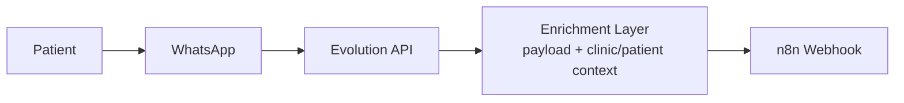
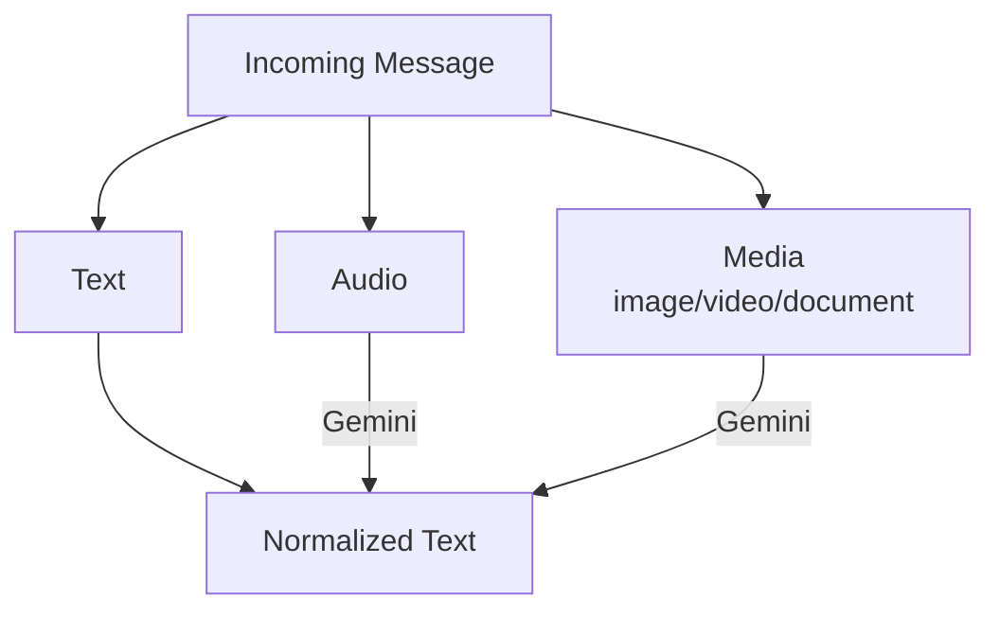
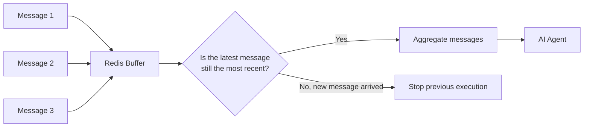

# 3. Message Flow



The enrichment layer belongs to the application's infrastructure (outside the main workflow) and adds the required context data to the payload — clinic, assistant, and patient information.

Once the data enters n8n, it is organized into conceptual context blocks:

```text
Assistant Configuration
        +
Clinic Configuration
        +
Patient Context
        +
Current Message
```

## Message Normalization

The system accepts multiple input formats and converts them into a common textual representation before any agent processing takes place.



This prevents each agent from having to handle multiple input formats individually.

## Message Buffering (Redis)

WhatsApp users often send several short messages in sequence ("Hi", "I wanted to know", "if you accept Unimed"). Processing each message individually would result in redundant AI executions and limited context per execution.

**Solution:** messages are accumulated in **Redis** within a ~30-second window.



If a newer message arrives before the window expires, the previous processing is interrupted — preventing duplicate or out-of-order responses.

Redis has a different responsibility here from conversational memory: it represents **temporary state**, not conversation history.

## Conversational Memory

Implemented using n8n's Chat Memory mechanism and persisted in **PostgreSQL**. It maintains a recent conversation history window to provide context to agents throughout the interaction.

| Component                | Responsibility                                           |
| ------------------------ | -------------------------------------------------------- |
| Redis                    | Temporary message buffer                                 |
| PostgreSQL / Chat Memory | Conversation history                                     |
| External System          | Persistent domain data (clinics, patients, appointments) |

---

⬅ [Multi-tenancy](./02-multi-tenancy.md) · [Index](../README.md) · Next → [Guardrails and Agents](./04-guardrails-and-agents.md)
