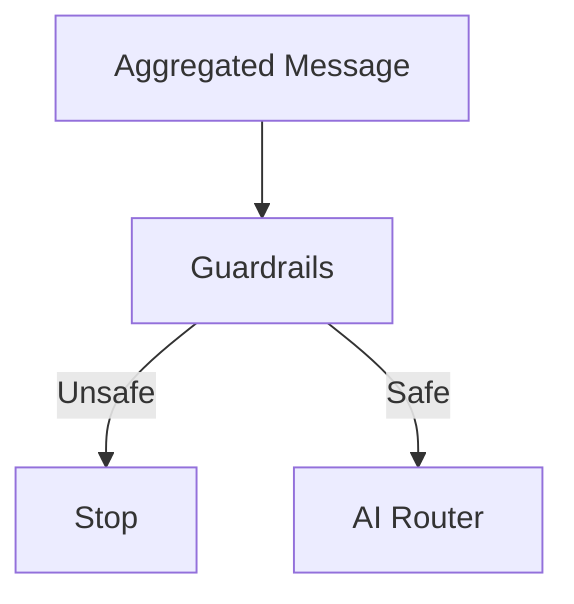
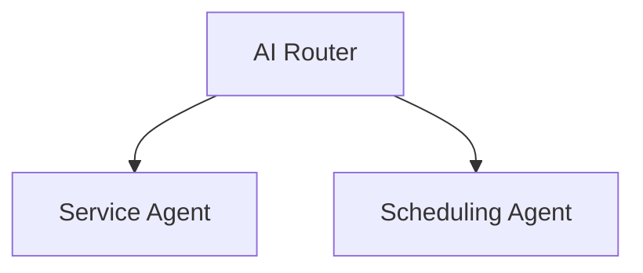
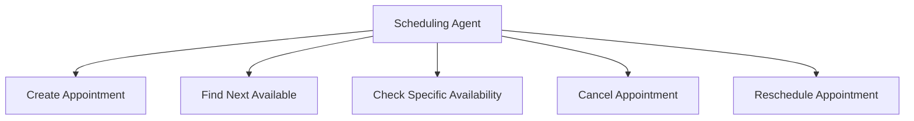

# 4. Guardrails and Agent Orchestration

## Guardrails

Before the message reaches the routing agent, a guardrail layer detects potential prompt injection, jailbreak attempts, and system instruction manipulation.

The goal is not to make the system invulnerable, but to add a preventive layer before intent interpretation takes place.

## Agent Orchestration

* **AI Router** — does not respond to the patient; it only identifies the intent and routes the request to the appropriate agent.
* **Service Agent** — handles general support and clinic-related institutional information.
* **Scheduling Agent** — handles appointment operations, with access levels configurable per tenant (basic plan: scheduling only; complete plan: scheduling, checking availability, finding the next available slot, cancellation, and rescheduling).

## Specialized Tools

Scheduling operations are not handled by a single monolithic tool:

Each tool triggers an independent sub-workflow, making maintenance easier and allowing individual operations to be modified without affecting the rest of the system.

---

⬅ [Message Flow](./03-message-flow.md) · [Index](../README.md) · Next → [Deterministic Execution](./05-deterministic-execution.md)
