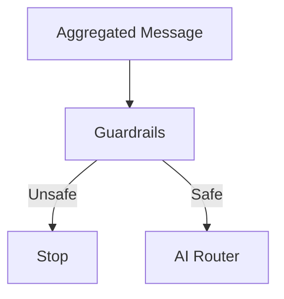
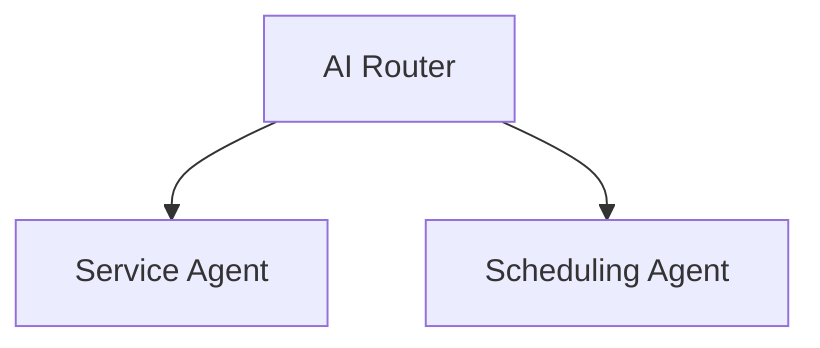
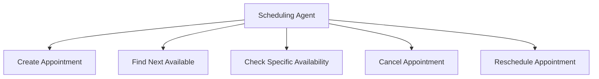

# 4. Guardrails e Orquestração de Agentes

## Guardrails

Antes de a mensagem chegar ao agente de roteamento, existe uma camada de guardrails para detectar tentativas de prompt injection, jailbreak e manipulação de instruções do sistema.

O objetivo não é tornar o sistema invulnerável, mas adicionar uma camada preventiva antes da interpretação de intenção pelo agente.

## Orquestração de agentes

- **AI Router** — não responde ao paciente; apenas identifica a intenção e encaminha para o agente correto.
- **Service Agent** — atendimento geral e informações institucionais da clínica.
- **Scheduling Agent** — operações de agenda, com nível de acesso configurável por tenant (plano básico: apenas agendar; plano completo: agendar, consultar disponibilidade, buscar próximo horário, cancelar e reagendar).

## Tools especializadas

As operações de agenda não vivem em uma única tool monolítica:

Cada tool aciona um sub-workflow independente, o que facilita manutenção e permite alterar uma operação sem tocar no restante do sistema.

---

⬅ [Fluxo de mensagens](./03-fluxo-de-mensagens.md) · [Índice](../README.md) · Próximo → [Execução determinística](./05-execucao-deterministica.md)
