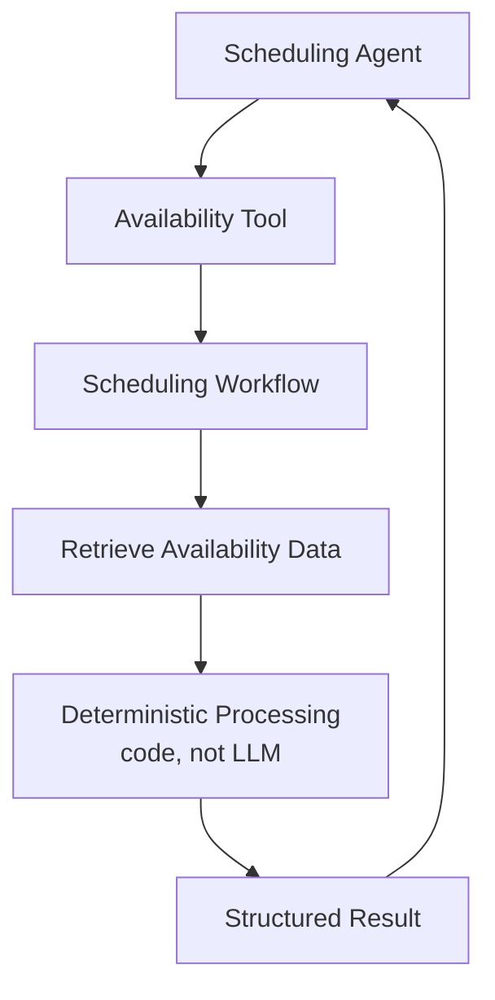
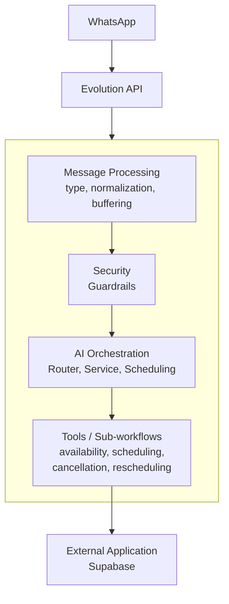

# 5. Deterministic Execution

One of the core technical decisions was to **deliberately reduce how much the LLM needs to reason about raw data**.



Calculating the next available appointment, checking conflicts, and enforcing business rules are handled in code within the sub-workflows — not by the LLM. The agent receives only the relevant structured result needed to formulate the response.

```text id="p6r2mk"
LLM        → interpretation and language
Code       → deterministic rules
```

## Responsibility Architecture



---

⬅ [Guardrails and Agents](./04-guardrails-and-agents.md) · [Index](../README.md) · Next → [Technical Stack](./06-technical-stack.md)
