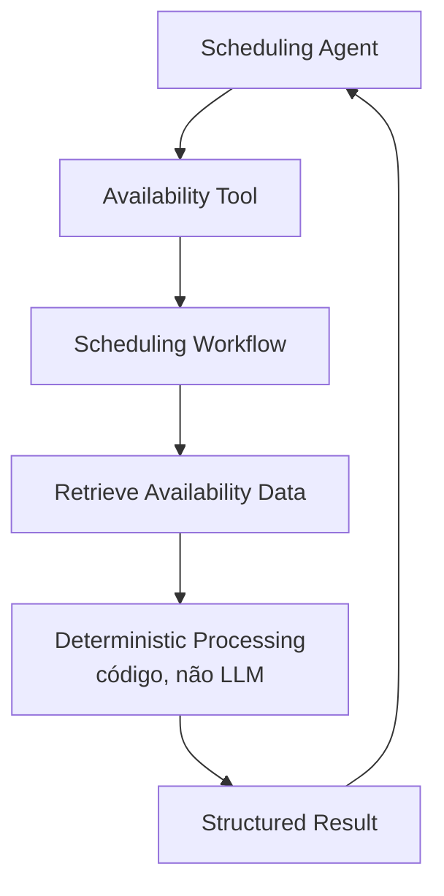
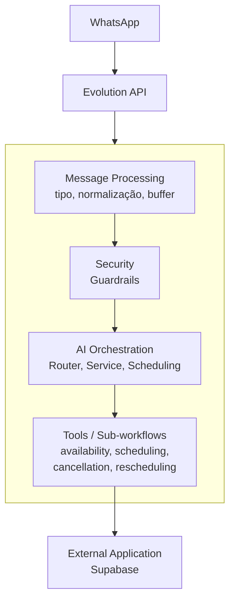

# 5. Execução Determinística

Uma das decisões técnicas centrais: **reduzir deliberadamente o quanto a LLM precisa raciocinar sobre dados brutos**.



Cálculo de próximo horário disponível, verificação de conflitos e regras de negócio são resolvidos em código dentro dos sub-workflows — não pela LLM. O agente recebe apenas o resultado estruturado e relevante para formular a resposta.

```
LLM        → interpretação e linguagem
Código     → regras determinísticas
```

Reagendamento, por exemplo, é tratado como operação composta (cancelar + criar), com a complexidade encapsulada no workflow — o agente só enxerga uma operação de alto nível.

## Arquitetura de responsabilidades



---

⬅ [Guardrails e agentes](./04-guardrails-e-agentes.md) · [Índice](../README.md) · Próximo → [Stack técnica](./06-stack-tecnica.md)
