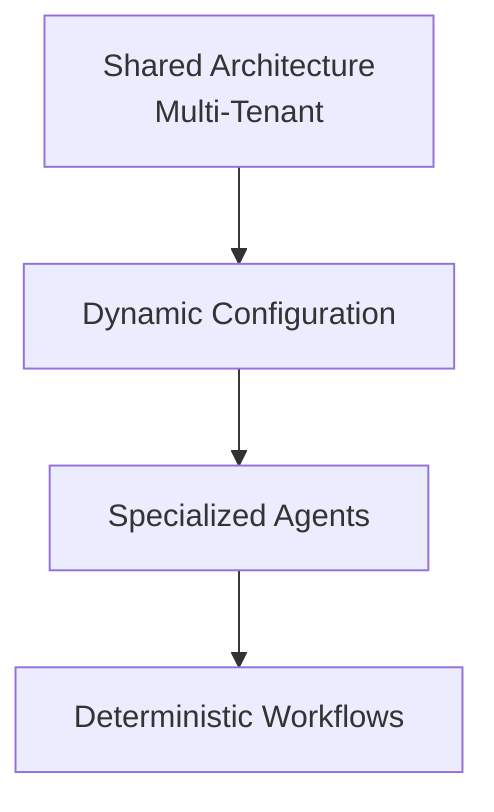

# 7. Limitações, Roadmap e Princípio de Design

## Limitações conhecidas

A identificação de pacientes é feita pelo número de telefone no sistema externo, o que hoje limita cenários como agendar em nome de outra pessoa ou um mesmo contato agendando para múltiplos pacientes. Esses casos são atualmente encaminhados para atendimento humano — uma limitação do modelo de dados do sistema externo, não da arquitetura do workflow em si.

## Roadmap

- Identidade de pacientes mais flexível (agendamento para terceiros e múltiplos pacientes)
- Evolução da memória conversacional
- Novas tools e agentes especializados
- Maior observabilidade
- Testes automatizados
- Novas integrações e evolução das regras de negócio

## Princípio de design

> Use IA para interpretar e interagir. Use código e workflows determinísticos para executar operações previsíveis.

---

⬅ [Stack técnica](./06-stack-tecnica.md) · [Índice](../README.md)
