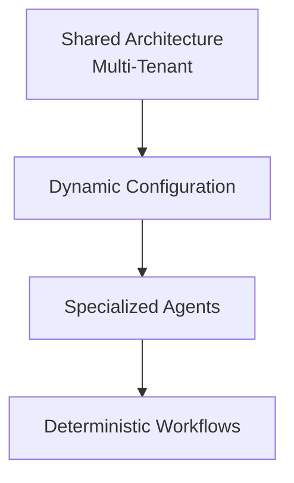

# 7. Limitations, Roadmap, and Design Principle

## Known Limitations

Patient identification is currently based on the phone number stored in the external system. This limits scenarios such as scheduling an appointment on behalf of another person or having a single contact schedule appointments for multiple patients.

These cases are currently routed to human support — a limitation of the external system's data model, rather than the workflow architecture itself.

## Roadmap

* More flexible patient identity management (scheduling for third parties and multiple patients)
* Further improvements to conversational memory
* Additional specialized tools and agents
* Enhanced observability
* Automated testing
* New integrations and evolving business rules

## Design Principle

> Use AI to interpret and interact. Use code and deterministic workflows to execute predictable operations.

---

⬅ [Technical Stack](./06-technical-stack.md) · [Index](../README.md)
